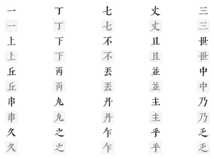

# Neural Style Transfer For Chinese Characters, by Rewrite, implemented in Tensorflow 2, with custom dataset.
    

## Movitaion
Remade the official code in Tensorflow 2 and keras.    

## Environments

Model: Rewrite. please refer to the original repository [Rewrite](https://github.com/kaonashi-tyc/Rewrite)  
Tensorflow: 2.9.1  
Keras: 2.9.0  
Datasets: Custom, please refer to the "datasets/images" folder.    

## References  
[Rewrite](https://github.com/kaonashi-tyc/Rewrite) - An official implemetation in Tensorflow 1.      
[Font](https://github.com/LingDong-/qiji-font)   
[XingZi-tf-keras](https://github.com/huangxinping/XingZi-tf-keras/) - An unofficial implementation in Tensorflow 2, which is also neural style transfer for Chinese characters.    
